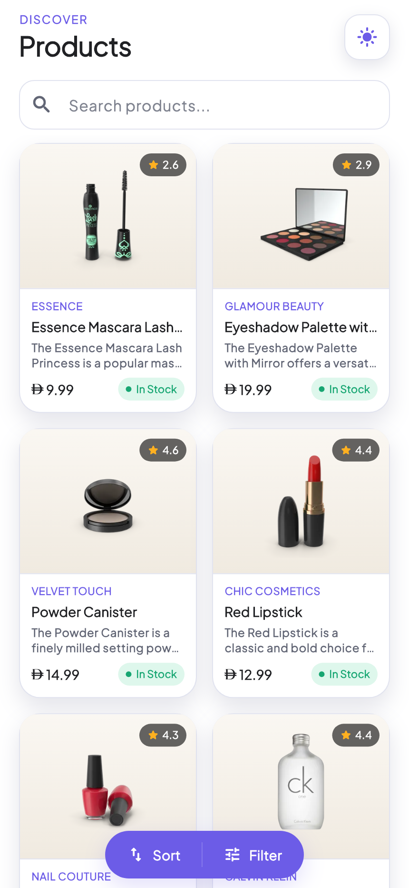
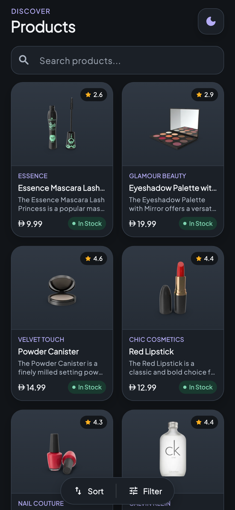
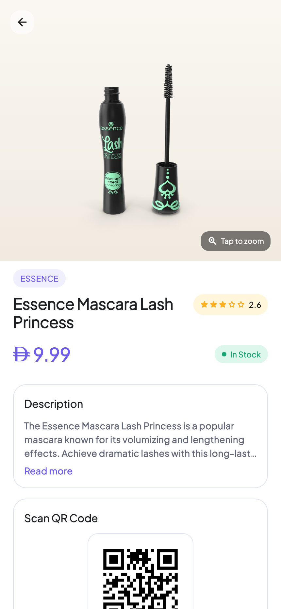
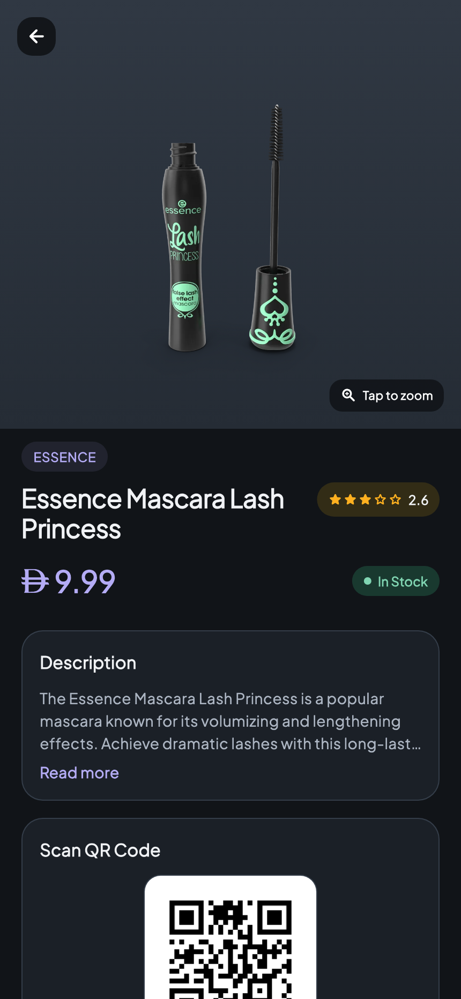

# Product Catalog

## Project overview

A Flutter app that uses the DummyJSON API to display products and their details. It includes search, category filtering, sorting, pagination, and light/dark themes. Product details include an image gallery, reviews, and a QR code.

## How to run the app

Requires Flutter 3.35.6 or a compatible version with Dart 3.9.2+, and an Android emulator, iOS simulator, or connected device.

```sh
git clone https://github.com/saadan299/assesement_flutterapp.git
cd assesement_flutterapp
flutter pub get
flutter run
```

An internet connection is required. No API key is needed.

## APIs used

Base URL: `https://dummyjson.com`

| Endpoint | Purpose |
| --- | --- |
| `GET /products` | Product list with `limit=10` and `skip` pagination |
| `GET /products/{id}` | Product details |
| `GET /products/search?q={query}` | Search products |
| `GET /products/categories` | Available categories |
| `GET /products/category/{category}` | Products in a category |

## Screenshots

App screens rendered with live API data; device system bars are not included.

| Product list — light | Product list — dark |
| --- | --- |
|  |  |

| Product details — light | Product details — dark |
| --- | --- |
|  |  |
